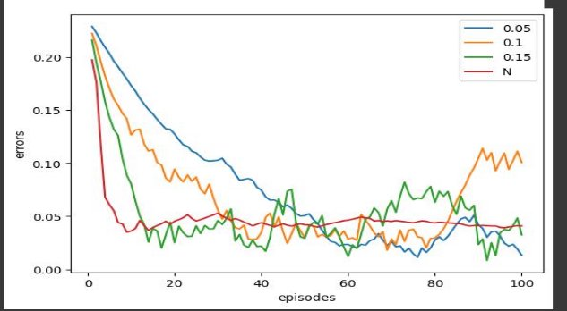

13 

Programming Assignment 1 

`                               `In partial fulfillment of the course Artificial Intelligence (CS F407)                                                            Submitted to Prof. Sujith Thomas 

Name - VIDHAN AGARWAL Identification number – 2020B3A71857G 

TABLE OF CONTENTS 

`                                                                                                              `Page No. 

1. Acknowledgements --------------------------------------------------------3    
1. Question 1: Multi-Armed Bandit-----------------------------------------4    

`        `INTRODUCTION -----------------------------------------------------------4 

`        `METHODOLOGY------------------------------------------------------------4 

`         `FINDINGS-------------------------------------------------------------------5 

`         `CONCLUSION--------------------------------------------------------------9 3.Question 2: Markov Reward Process------------------------------------10 

`        `INTRODUCTION -----------------------------------------------------------10 

`       `METHODOLOGY------------------------------------------------------------10 

`         `FINDINGS-------------------------------------------------------------------11 

`         `CONCLUSION--------------------------------------------------------------12 4. List of References------------------------------------------------------------13 

ACKNOWLEDGEMENTS 

The completion of the undertaking could not have been without the participation and assistance of some people.  

Their contributions are sincerely appreciated and gratefully acknowledged. I would like to express my deep appreciation and indebtedness, particular to   Professor Sujith Thomas for giving the assignment and helping in clearing some doubts which came during the assignment. 

Above all, to the great almighty, the author of knowledge and wisdom for his countless love.  

Thank you.  

QUESTION 1:   *MULTI-ARMED BANDIT*  

INTRODUCTION 

`  `The objective of this question is to construct a 10-armed testbed and compare the following three action value estimation: 

1) epsilon – greedy action selection 
   2) Optimistic initial value  
   2) Upper-Confidence-Bound Action selection 

We are required to vary the parameters in the above methods. 

METHODOLOGY 

The above algorithm will be implemented using python and 2000 randomly generated 10-armed bandit problems. The action values were selected according to the normal distribution with mean 0 and variance 1. Then, when a learning method applied to that problem selected action At  time step t, the actual reward, Rt, was selected from a normal distribution with mean q\*(At) and variance 1. When used to solve one of the bandit issues, we may evaluate the effectiveness and behaviour of any learning approach over a period of 1000 time steps as it gains experience. This completes a run. We repeated this for 2000 separate runs, each with a different bandit scenario, and collected metrics of the typical behaviour of the learning system. 

For learning rate change we used **alpha** instead of learning rate **1/N**. 

For action selection in upper confidence bound action selection we use the following formula. 

FINDINGS 

In **part (a)** the findings of varying the epsilon values are given below 

The legend which has 0.1,0.01,0,0.05 signifies the algorithm having learning rate 1/N. Rest two have a learning rate of alpha. The graph above shows the increase in expected reward with experience. **The greedy method improved slightly faster than the other methods at the very beginning, but then levelled at a lower level**. It achieved a reward-per-step of only about 1, compared with the best possible of about 1.55 on this testbed. The greedy algorithm performed worst because it got caught in suboptimal actions. When the **degree of exploration is increased it performs better as it does not get stuck anywhere and continues to explore**. The epsilon = 0.01 explored more but never chose the most optimum action more than 99% of time it moves slowly but eventually would outperform 0.1 where epsilon = 0.05 performs the best as it shows convergence to the most optimal value of 1.55 in less time and outperform epsilon = 0.1 faster.The lower graph demonstrates that the greedy strategy only identified the best course of action in only one-third of the tasks. Its earliest samples of the ideal motion in the remaining two-thirds were 

unsatisfactory, and it never tried it again. 

However, **epsilon = 0.05 outperforms** yet again even in the number of optimal actions taken.  

In **part (b)** we compared the optimistic greedy values with **part (a)** results 

The optimistic approach performs poorly at first because it investigates more, but with time, as its exploration slows, it improves. We think of it as a straightforward method that can be effective for stationary situations, but it is not a universal strategy for promoting exploration**. The closer the value of Q to the real value the faster it converges as seen for Q=3 and Q=5**. Greedy actions in this case are yielding better results. As the exploration decreases it converges faster to the real values. **We can see that the concept of optimistic initial values in stationary problems are yielding better results in choosing the right optimum actions.** 

In part **c** we compare the values of UCB with part **(a)** and part **(b)** 

Upper Confidence Bound action selection often performs well, as shown as compared to epsilon greedy action selection in stationary problems. But here **too optimistic initial value overtakes both the methods in terms of performance**. Also, **UCB is slow** as an algorithm as compared to part epsilon greedy and optimistic initial value as it involves **high computation**. It is also observed that **c=1** is the best choice for degree of exploration in UCB in our case. **In the lower graph it is seen that in the long run the number of optimal actions taken will be more for epsilon greedy and optimistic initial values methods.** 

CONCLUSION 

It can be concluded that the optimistic initial is the best method to achieve the optimal task if the problem is stationary and the initial values, we chose is optimistic enough. UCB also performs better than epsilon greedy algorithm in stationary problems. However, when it comes to non-stationary problems epsilon greedy approach will be the best method to take optimal actions. Initial value of epsilon can be 0.05 and then we can reduce the degree of exploration in the long run to get to the optimal action and converge. 

QUESTION 2: MARKOV REWARD PROCESS 

` `INTRODUCTION 

We are required to implement Temporal Difference learning algorithm based on the following Markov reward process. 

In this MRP, all episodes start in the centre state, C, then proceed either left or right by one state on each step, with equal probability. Episodes terminate either on the extreme left or the extreme right. When an episode terminates on the right, a reward of +1 occurs; all other rewards are zero. The true value of the centre state is v(C)=0.5. The true values of all the states, A through E, are  1/ 6 , 2/6 , 3/6 , 4/6 , and 5/6. 

METHODOLOGY 

We use TD (0) algorithm for the above Markov reward process. 

The above algorithm is implemented for 100 episodes and the root mean square values are plotted comparing it with different values of alpha (learning parameter). 

FINDINGS 

The graph below shows the values learned by the algorithm after 100 episodes.  

The graph is plotted at different episodes which shows how **the values as close to the true values in the final episode.** The graph below shows how the root mean squared error values differed for different values of alpha. 

The TD **algorithm asymptotically converges to the right prediction** hence the graph shows how for different values of alpha the root mean squared error **values are converging to zero**. The graph also shows that how for large values of alpha like 0.15 the root mean squared error values are fluctuating. As the alpha values are large asymptotically the values will fluctuate around true values. Here N denotes the algorithm used 1/N as learning rate and other values denote the values of alpha used**. Larger the value of alpha more will be the fluctuation around true values. 1/N will also converge to zero asymptotically and not fluctuate unlike alpha**.** 

CONCLUSION 

TD (0) is a good algorithm for predicting true values for Markov reward processes as in a smaller number of episodes it almost converges to the true values (it converges asymptotically). For improving the algorithm’s efficiency we can set a value of alpha and decrease its value gradually to avoid fluctuations. 

LIST OF REFERENCES 

Reinforcement Learning: An Introduction second edition Richard S. Sutton and Andrew G. Barto 
